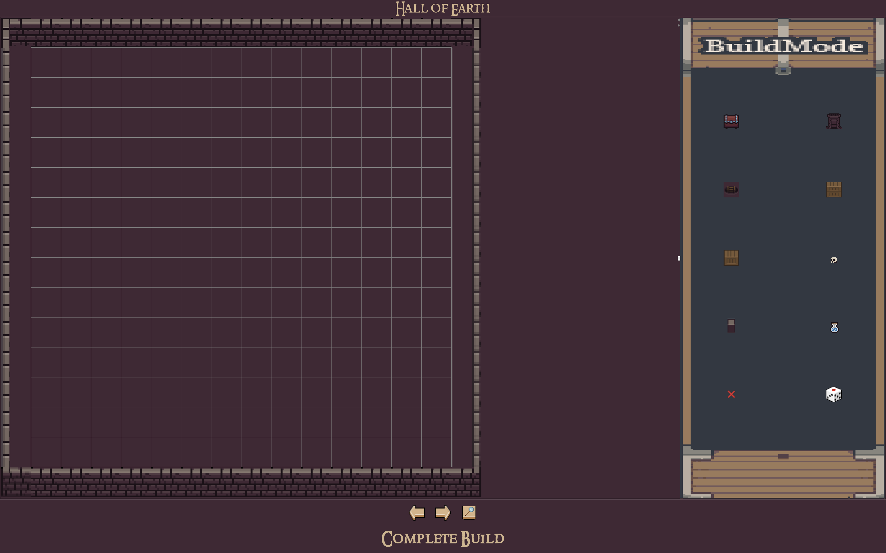
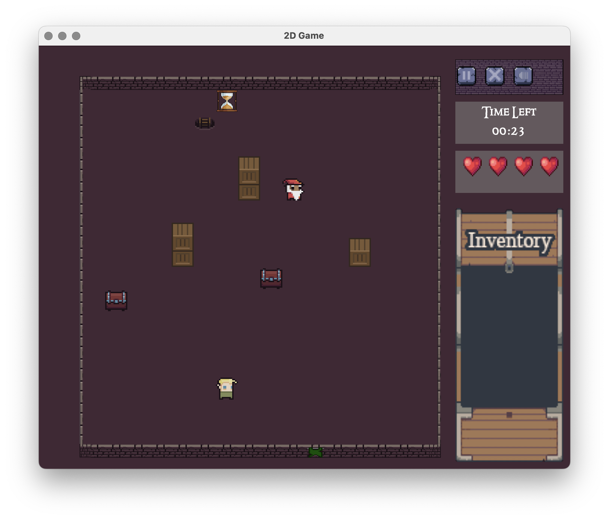
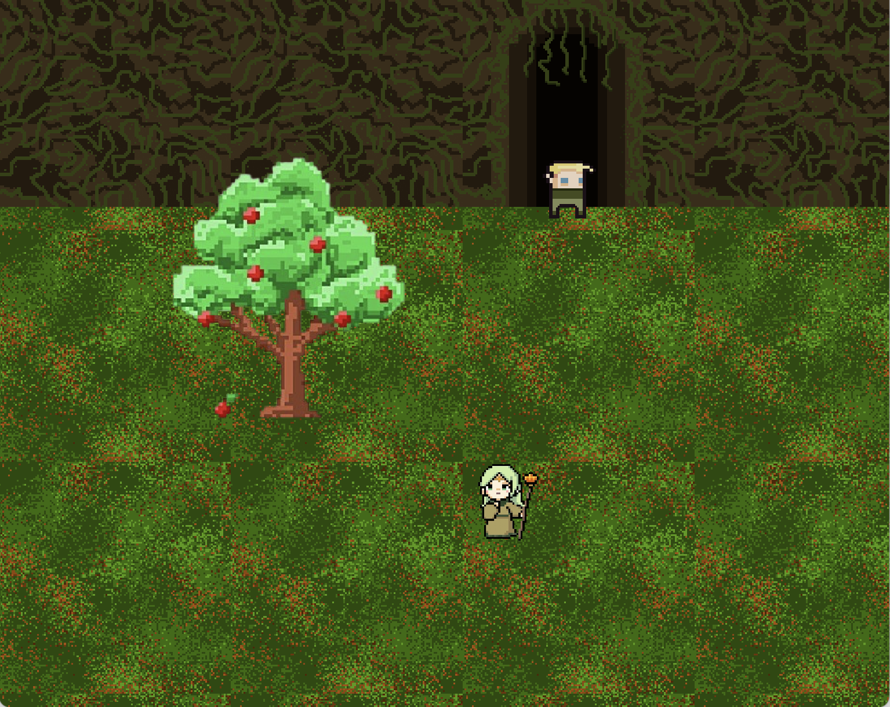

# gameName

A roguelike game for the COMP 302 Software Engineering course in Fall 2024.

## Installation

### Prerequisites
- Java 23.0.1

### Steps to Install
1. The code works after cloning, with no additional setup required.

### Running the Game
- Run [Main.java](src/domain/main/Main.java)

## Gameplay
You can create your own halls. Discover the runes in four halls to escape, but watch out for monsters. Use enchantments to fight back and stay safe.

### Controls

 Action         | Key (Keyboard) |
|----------------|----------------|
| Move Up        | ↑ (Up Arrow)   |
| Move Left      | ← (Left Arrow) |
| Move Down      | ↓ (Down Arrow) |
| Move Right     | → (Right Arrow)|
| Search Structure     | Left Click |
| Collect Enchantment | Left Click |
| Use Reveal | R |
| Use Cloak of Protection | P |
| Use Cloak of Protection | B, then W / A / S / D |
| Use Speed | Q |
| Interact with Elf | E |

## Screenshots

## Contributing

We welcome contributions! Please follow these steps to contribute:
1. Fork the repository.
2. Create a new branch for your feature or bug fix.
3. Submit a pull request.

## License
This project is currently unlicensed. You may use, modify, or distribute it at your own risk, but no warranty is provided.

## Contact

If you have any questions or suggestions, feel free to reach out to us at the following email:
groupname302@gmail.com.

## Acknowledgements

We used the following materials to create this game:
- The sound effect for the monster *Time Thief* was taken from [Ladies and Centilmen](https://www.youtube.com/watch?v=40Ka2G6qYMY)
- The music in the main menu was taken from [Minecraft Volume Alpha](https://www.youtube.com/watch?v=qq-RGFyaq0U&list=PL3817D41C7D841E23&index=16)
- [MEGALOVANIA](https://www.youtube.com/watch?v=0FCvzsVlXpQ)
- [Determination](https://www.youtube.com/watch?v=h1wSPmlZV-w)
- [Course Clear](https://www.youtube.com/watch?v=wRkp6apEovA)

## Comments

This game was created by the group *groupName* for the COMP 302 Software Engineering course in Fall 2024. We hope you enjoy playing it!

For those who are taking the course, and are looking at this repository for inspiration, we would like to give you some advice:
- Do not devote too much time to the game, as you won't get what you deserve from it. Fulfilling the basic requirements is more than enough.
- Do not try to make the game perfect. It is not worth it. You will not get a higher grade for it.
- Do not worry about equal collaboration. Neither the professor nor the TAs will check it. Just make sure that everyone has contributed something.
- Do not worry about the quality of the code. The professor and the TAs will not check it. Just make sure that the code works.
- Do not worry about the quality of the game. The professor and the TAs will not check it. Just make sure that the game works.
- Do not worry about the quality of the documentation. The professor and the TAs will not check it. Just make sure that the documentation is there.
- In case you do not know, you can present your work via a pre-recorded video. You do not have to play the game live.

Instead, we recommend the following:
- Focus on the exams. They are worth more than the project. Although percentages tell otherwise, everyone gets almost full marks from the project. Therefore, the exams are decisive.
- Attendance points are important. Do not miss the lectures. Although not much covered in the lectures, the 3 points are very decisive; again, because everyone gets almost full marks from the project.