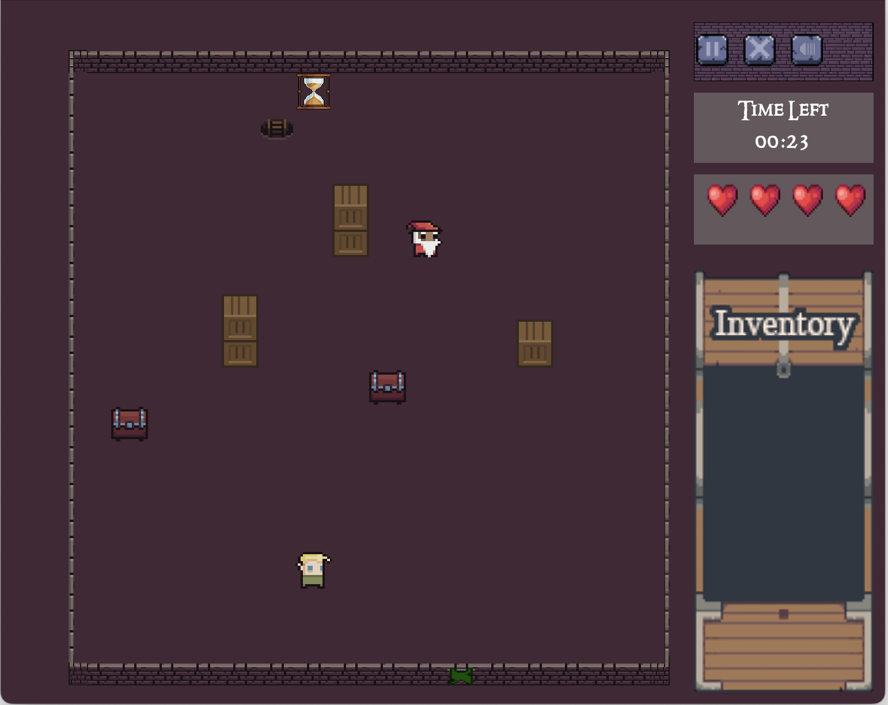

# gameName

A roguelike game for the COMP 302 Software Engineering course in Fall 2024.

## Installation

### Prerequisites
- Java 23.0.1

### Steps to Install
1. The code works after cloning, with no additional setup required.

### Running the Game
- Run [Main.java](src/domain/main/Main.java)

## Gameplay
You can create your own halls. Discover the runes in four halls to escape, but watch out for monsters. Use enchantments to fight back and stay safe.

### Controls

 Action         | Key (Keyboard) |
|----------------|----------------|
| Move Up        | ↑ (Up Arrow)   |
| Move Left      | ← (Left Arrow) |
| Move Down      | ↓ (Down Arrow) |
| Move Right     | → (Right Arrow)|
| Search Structure     | Left Click |
| Collect Enchantment | Left Click |
| Use Reveal | R |
| Use Cloak of Protection | P |
| Use Cloak of Protection | B, then W / A / S / D |
| Use Speed | Q |
| Interact with Elf | E |

## Screenshots

## Contributing

We welcome contributions! Please follow these steps to contribute:
1. Fork the repository.
2. Create a new branch for your feature or bug fix.
3. Submit a pull request.

## License

## Contact

If you have any questions or suggestions, feel free to reach out to us at the following email:
groupname302@gmail.com.

## Acknowledgements
